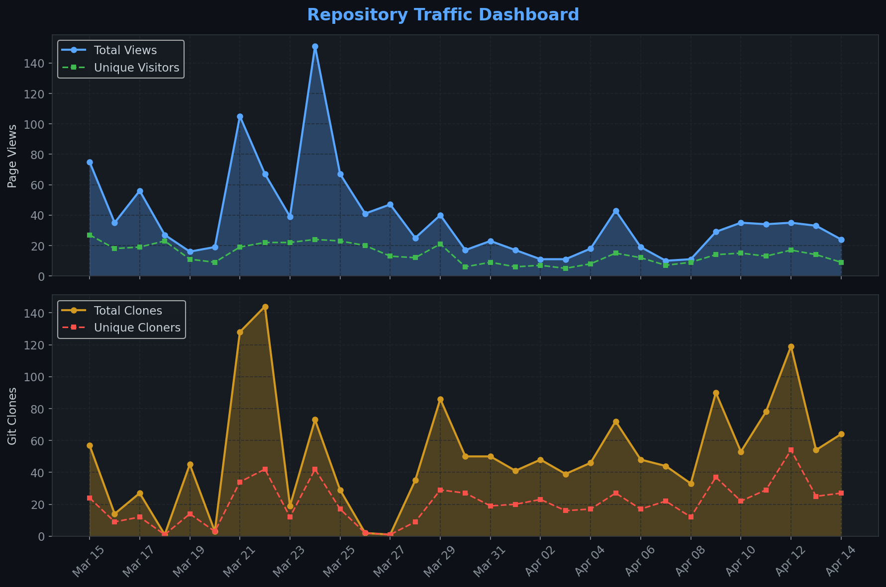
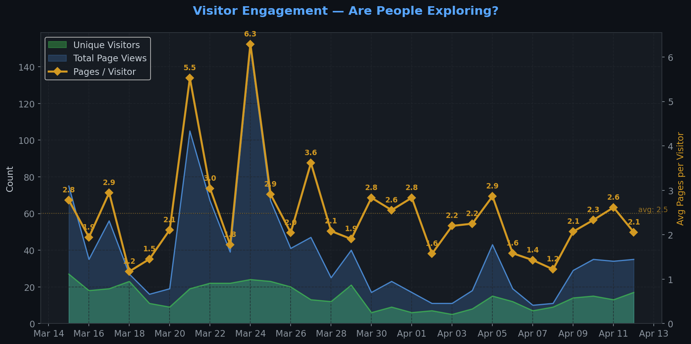
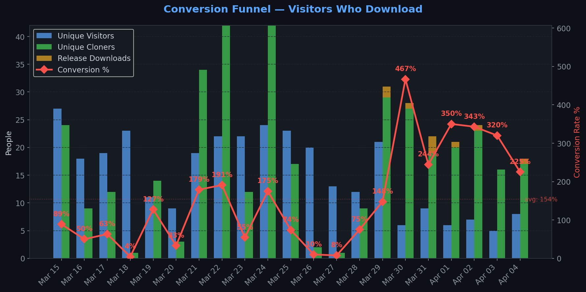
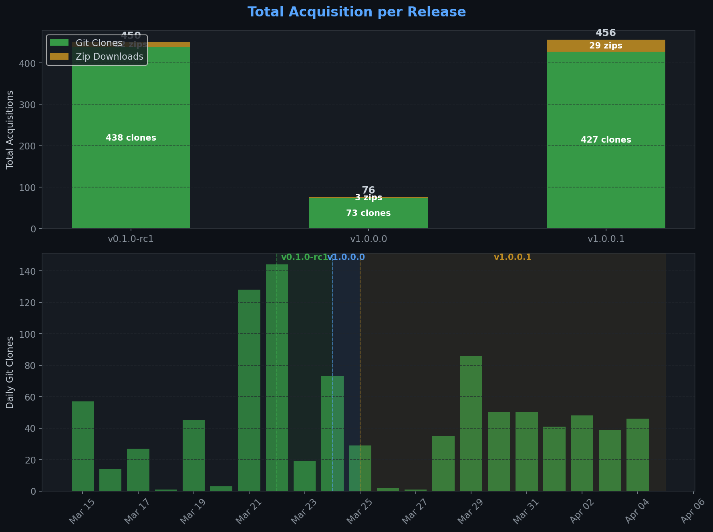
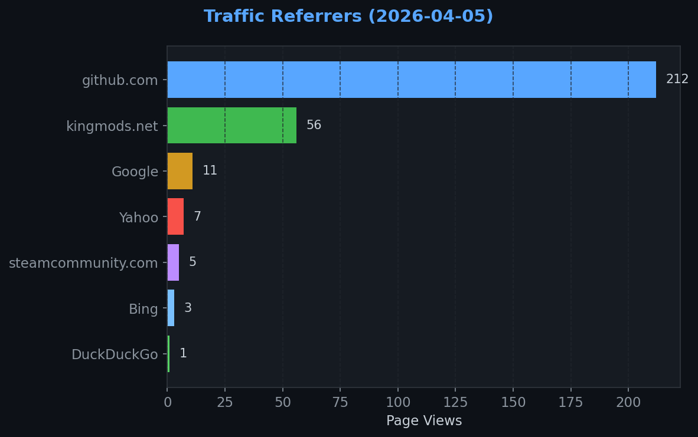
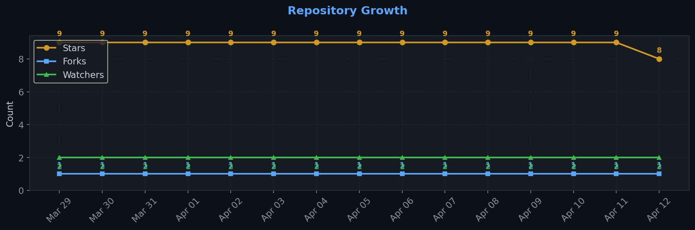

# Repository Traffic Dashboard

**Last updated:** 2026-04-02T18:40:28Z
**Days tracked:** 5 | **Download snapshots:** 22 (hourly)

---

## Views & Clones (14-day window, preserved forever)

| Metric | 14-Day Total | Unique |
|--------|-------------|--------|
| Page Views | 674 | 142 |
| Git Clones | 706 | 231 |

> **Engagement:** 4.7 pages per visitor (14-day avg)

---

## Visitor Engagement

> Higher = visitors exploring more pages. 1.0 = bounce. 3.0+ = deeply engaged.

---

## Conversion Funnel

> **14-day conversion:** 272 of 142 visitors cloned or downloaded (**191.5%**)
>
> Unique cloners: 231 | Release downloads: 41

---

## Total Acquisition per Release (Downloads + Clones)

| Channel | Count |
|---------|-------|
| Zip Downloads | 41 |
| Git Clones (14-day) | 706 |
| **Total Acquisitions** | **747** |

---

## Referrers

| Source | Views | Unique |
|--------|-------|--------|
| github.com | 238 | 67 |
| kingmods.net | 58 | 36 |
| Google | 11 | 6 |
| steamcommunity.com | 5 | 2 |
| Yahoo | 5 | 1 |
| Bing | 3 | 1 |

---

## Repository Growth

| Metric | Current |
|--------|---------|
| Stars | 9 |
| Forks | 1 |
| Watchers | 2 |

---

## Top Pages (14-day)

| Page | Views | Unique |
|------|-------|--------|
| `/TheCodingDad-TisonK/FS25_MarketDynamics` | 225 | 87 |
| `/TheCodingDad-TisonK/FS25_MarketDynamics/issues` | 72 | 23 |
| `/TheCodingDad-TisonK/FS25_MarketDynamics/releases/tag/v0.1.0-rc1` | 43 | 34 |
| `/TheCodingDad-TisonK/FS25_MarketDynamics/releases/tag/v1.0.0.1` | 35 | 16 |
| `/TheCodingDad-TisonK/FS25_MarketDynamics/issues/10` | 31 | 5 |
| `/TheCodingDad-TisonK/FS25_MarketDynamics/tree/main` | 24 | 5 |
| `/TheCodingDad-TisonK/FS25_MarketDynamics/releases` | 13 | 9 |
| `/TheCodingDad-TisonK/FS25_MarketDynamics/releases/tag/v1.0.0.0` | 12 | 8 |
| `/TheCodingDad-TisonK/FS25_MarketDynamics/pulls` | 11 | 5 |
| `/TheCodingDad-TisonK/FS25_MarketDynamics/pull/3` | 10 | 9 |

---

## Data Files

| File | Description | Granularity |
|------|-------------|-------------|
| [daily.json](daily.json) | Views & clones per day (never expires) | Daily |
| [downloads.json](downloads.json) | Release download snapshots | Hourly |
| [referrers.json](referrers.json) | Referrer snapshots | Daily |
| [metadata.json](metadata.json) | Stars, forks, watchers | Daily |
| [stats.json](stats.json) | Combined legacy snapshots | 6-hourly |

---
*Hourly download tracking + full dashboard with engagement metrics every 6 hours*
*Auto-generated by [traffic-stats.yml](../../.github/workflows/traffic-stats.yml)*
